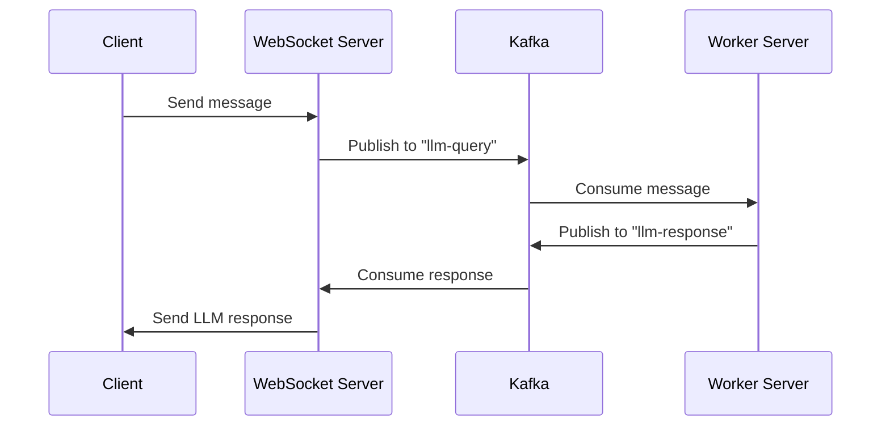

# ⚙️ ASK-WITH-CONTEXT — Intelligent File & Chat Processing Platform

This document describes the full architecture, workflow, and development setup for the **Ask-With-Context** platform — a distributed system designed for file-based knowledge extraction, real-time communication, and LLM-powered conversation.

---

## 🏗️ 1. System Overview


### 🧩 Core Components

| Service | Description | Port |
|---------|-------------|------|
| `client` | Frontend application (React) | 3000 |
| `http-server` | Handles user authentication and APIs | 3001 |
| `file-handler` | Manages file uploads and processing | 3002 |
| `worker-server` | LLM worker that processes chat queries | 3003 |
| `ws-server` | WebSocket gateway for real-time messaging | 8080 |
| `nats-server` | Message broker for live file update broadcasts | 4222 |
| `kafka-broker` | Kafka cluster for async event-driven processing | 9092 |

---

## 📁 2. File Handler Workflow

The file handler follows these steps:

1. Listens to `file-handler` Kafka topic
2. Downloads the file from S3
3. Processes and summarizes it
4. Stores summarized content along with `chatId` and `sessionId`
5. Sends status updates to NATS so that clients can see real-time progress

### ✅ NATS → Client Updates

**Subject:** `file.update.${sessionId}`

**Payload:**
```json
{
  "status": "processing",
  "progress": 80
}
```

---

## 💬 3. Chat Query Flow

When a user sends a chat message via WebSocket:

1. Message → Published to Kafka topic `llm-query`
2. Worker Server consumes `llm-query` topic, processes query with the LLM
3. Worker publishes output to Kafka topic `llm-response`
4. WebSocket Server consumes `llm-response` and sends result back to the correct user

### Sequence Diagram



✅ Real-time updates for file summaries and chat results are sent through NATS.

---

## 🌐 4. API Endpoints

### 🧑 User Authentication

| Method | Endpoint | Description |
|--------|----------|-------------|
| POST | `/user/signup` | Register a new user |
| POST | `/user/signin` | Authenticate a user |
| GET | `/api/userCredentials` | Get user info |

### 📂 File Management

| Method | Endpoint | Description |
|--------|----------|-------------|
| POST | `/uploadFile/uploadFile` | Upload file and initiate processing |

### 💬 Session Management

| Method | Endpoint | Description |
|--------|----------|-------------|
| GET | `/getUserSessions/getUserSessions/session` | Get active sessions |
| GET | `/getUserSessions/getUserSessions/getSessionData` | Fetch session data with summaries |

---

## ⚡ 5. Message Brokers

### 📦 Kafka Topics

| Topic | Publisher | Consumer | Purpose |
|-------|-----------|----------|---------|
| `file-handler` | HTTP Server | File Handler | File processing queue |
| `llm-query` | WebSocket Server | Worker Server | Incoming chat queries |
| `llm-response` | Worker Server | WebSocket Server | LLM responses to client |

### 🛰️ NATS Subjects

| Subject Pattern | Producer | Consumer | Description |
|-----------------|----------|----------|-------------|
| `file.update.${sessionId}` | File Handler | WebSocket Server / Client | File processing progress |
| `llm.update.${chatId}` | Worker Server | WebSocket Server | LLM response updates |

---

## 🧩 6. Local Development Setup

### 🪣 1️⃣ Clone & Fork

```bash
git clone https://github.com/<your-username>/ask-with-context.git
cd ask-with-context
```

### 🔐 2️⃣ Environment Variables

Create `.env` in the root:

```bash
# Core
NODE_ENV=development
BASE_URL=http://localhost:3001

# Ports
HTTP_PORT=3001
WS_PORT=8080
FILE_HANDLER_PORT=3002
WORKER_PORT=3003

# AWS
AWS_ACCESS_KEY_ID=your_key
AWS_SECRET_ACCESS_KEY=your_secret
S3_BUCKET=your_bucket

# Kafka
KAFKA_BROKER=kafka:9092
KAFKA_CLIENT_ID=ask_with_context

# Redis / NATS
REDIS_HOST=redis
NATS_URL=nats://nats:4222
```

### 🐳 3️⃣ Run with Docker Compose

```bash
docker compose up --build
```

This starts all core services:

* HTTP Server → `:3001`
* File Handler → `:3002`
* Worker Server → `:3003`
* WebSocket Server → `:8080`
* Kafka, NATS, Redis → Internal containers

### 🧠 4️⃣ Verify Setup

Check logs:

```bash
docker ps
docker logs http-server -f
```

Access:

* **API:** http://localhost:3001
* **Client:** http://localhost:3000
* **Kafka UI:** http://localhost:8085
* **NATS:** http://localhost:8222

---

## 🚀 7. Scalability & Architecture

| Component | Scalable | Description |
|-----------|----------|-------------|
| WebSocket Servers | ✅ Horizontal | Each manages its own clients |
| Kafka Topics | ✅ High throughput | Decoupled message passing |
| File Handler | ✅ Parallelizable | Multiple consumers per topic |
| Worker Server | ✅ Horizontally scalable | Each handles a share of LLM queries |
| NATS | ✅ Real-time | Lightweight push-based communication |

---

## 🧱 8. Monorepo (Turborepo)

This system uses Turborepo to manage multiple services efficiently.

```
apps/
 ├─ client/
 ├─ http-server/
 ├─ file-handler/
 ├─ worker-server/
 └─ ws-server/
```
